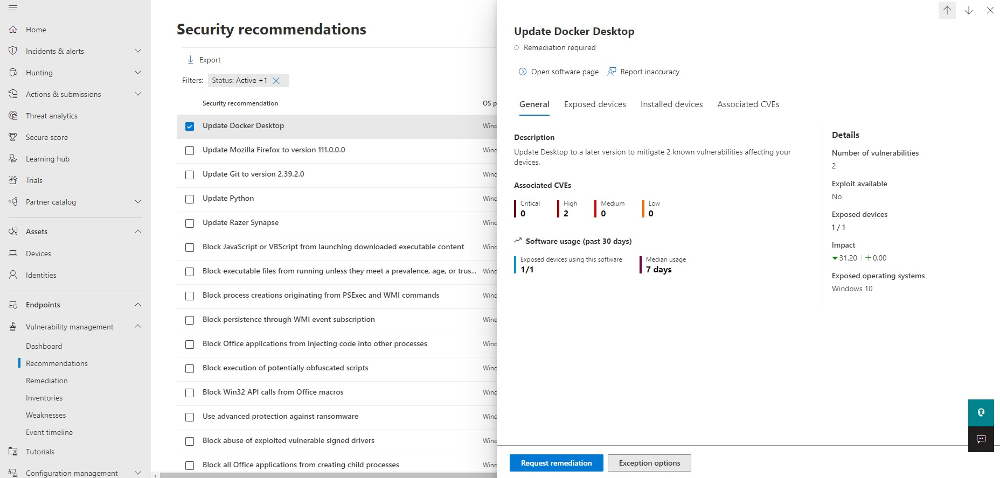
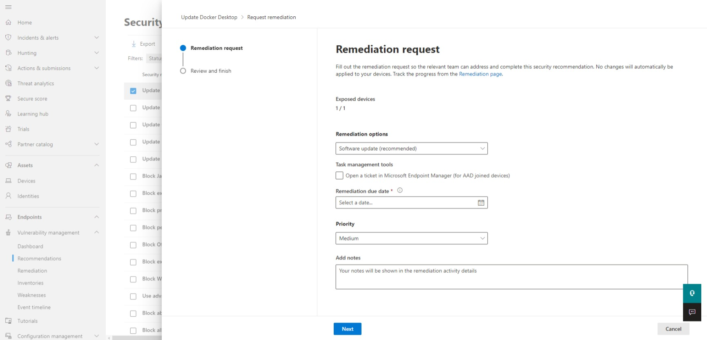
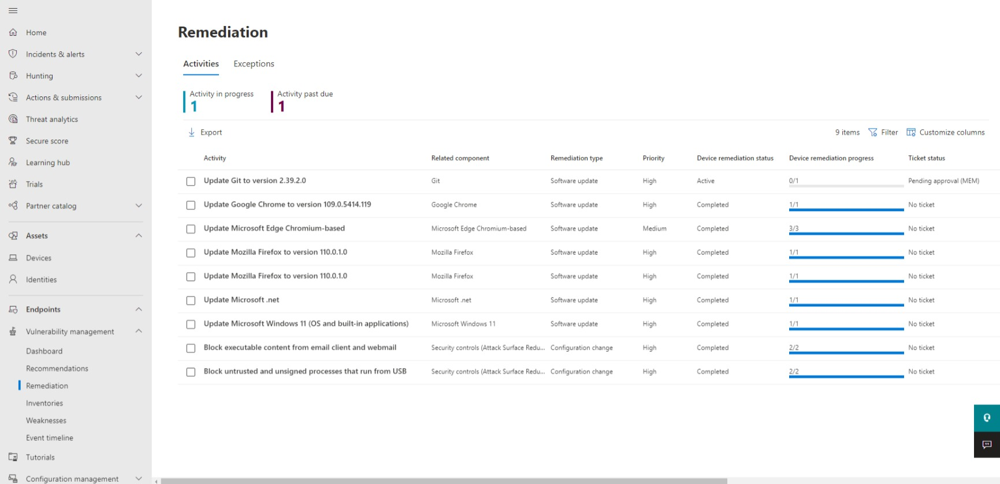

# Mitigate threats using Microsoft 365 Defender (25–30%)

# Mitigate threats to the productivity environment by using Microsoft 365 Defender

Microsoft 365 Defender is a unified pre and post-breach enterprise defense solution that coordinates detection, prevention, investigation, and response across endpoints, identities, email, and apps to provide protection against sophisticated threats.

## Investigate, respond, and remediate threats to Microsoft Teams, SharePoint, and OneDrive

## Investigate, respond, and remediate threats to email by using Microsoft Defender for Office 365

## Investigate and respond to alerts generated from Data Loss Prevention policies

## Investigate and respond to alerts generated from insider risk policies

## Identify, investigate, and remediate security risks by using Microsoft Defender for Cloud Apps

## Configure Microsoft Defender for Cloud Apps to generate alerts and reports to detect threats

# Mitigate endpoint threats by using Microsoft Defender for Endpoint

Defender for Endpoint is a platform designed to help enterprise networks prevent, detect, investigate, and respond to advanced threats on endpoint devices.

**Capabilities of Defender for Endpoint:**

- **Threat and vulnerability management**: providing **real-time visibility** & helps identify ways to improve an org's security posture
- **Attack surface reduction**: eliminates risk or unnecessary surface areas & **restricts dangerous code from being executed**
- **Advanced protection**: uses **ML and deep analysis** to protect against **file based malware**
- **Endpoint detection & response (EDR)**: monitors behavior and attacker techniques to **detect & respond** to advanced attacks
- Uses **AI** to **automatically investigate alerts & remediate** complex threats quickly
- **Microsoft threat experts** bring knowledge and **proactive threat hunting** to an org's SOC

Defender for Endpoint uses the following technologies built into Windows 10 and Microsoft's cloud service:

- **Endpoint behavioral sensors:** **built into WIndows 10**, these **collect and process behavioral signals from the OS**. Data is sent from the sensors to an org's private cloud instance of Defender for Endpoint.
- **Cloud security analytics:** uses **ML, big data, and unique Microsoft optics** across the **Windows ecosystem, enterprise cloud products, and online assets**. Behavior signals are then translated into insights, detections, and recommended responses to advanced threats.
- **Threat intelligence**: generated by **Microsoft hunters & security teams**, and **augmented by threat intel provided by partners**, threat intelligence enables Defender for Endpoint to **identify attacker tools, techniques, and procedures**, as well as **generating alerts** when these are collected with sensor data.

Advanced hunting within Defender for Endpoint allows you to hunt for potential threats across the org using a powerful search & query tool. 

## Manage data retention, alert notification, and advanced features

## Recommend security baselines for devices

## Respond to incidents and alerts

## Manage automated investigations and remediations

**Note:** To configure automated investigation & remediation, the feature must be enabled and device groups must be setup.

## Manage manual investigations and remediations

### **Investigation**

### **Remediation**

Vulnerability management capabilities bridges the gap between Security & IT admins through the remediation request workflow. Security admins can request for IT admins to remediate a vulnerability from the Recommendations page within Defender to Intune.

Creating remediation requests:

- Click on Vulnerability management, under Endpoints, from the navigation menu in the <a href="https://security.microsoft.com">Microsoft 365 Defender portal</a> then click on Recommendations

- Click on a recommendation to request remediation for

- Click Request remediation

- Fill out the form with the following information:
    - Remediation options:
        - Software update
        - Software uninstall
        - Attention required
    - Task management tools
        - Open a ticket in Microsoft Endpoint Manage (for AAD joined devices)
    - Set the Remediation due date
    - Set the Priority
    - Add notes (optional)
    - Click Next then review and submit
        - On the review & finish page, you can optionally export the remediation request data to a CSV file

Submitting a remediation request will create a remediation activity item within vulnerability management, which can be used for monitoring the remediation progress for the recommendation. 
    
- This will **not** trigger a remediation or apply changes to devices. 

Be sure to inform your IT admin about the new request to have them log into Intune to approve or reject the request.

Security admins can view the Remediation page to see the status of remediation requests.

## Assess and recommend endpoint configurations to reduce and remediate vulnerabilities by using the Microsoft's threat and vulnerability management solution

## Manage endpoint threat indicators

# Mitigate identity threats

## Identify and remediate security risks related to events for Microsoft Azure Active Directory (Azure AD), part of Microsoft Entra

## Identify and remediate security risks related to Azure AD Identity Protection events

## Identify and remediate security risks related to Azure AD Conditional Access events

## Identify and remediate security risks related to Active Directory Domain Services using Microsoft Defender for Identity

# Manage extended detection and response (XDR) in Microsoft 365 Defender

## Manage incidents across Microsoft 365 Defender products

M365 Defender provides a cross-domain threat correlation portal to investigate threats. 

- Incidents are based on related alerts created when a malicious event is detected on your network.
- An incident is a collection of correlated alerts that make up the full story of an attack. 

Individual alerts provide valuable information about on-going attacks, however, attacks typically employ multiple vectors and techniques to carry out a breach. Putting these clues together can be time-consuming. 

M365 Defender automatically aggregates malicious and suspicious events from different devices, users, and mailbox entities, then groups related alerts into an incident to give security professionals a comprehensive view of an attack.

Incidents from the last 30 days are shown in the incident queue, and allow security professionals to determine which incidents should be prioritized, based on risk level and other factors.

Incidents can be:

- Renamed
- Assigned to specific analysts
- Classified
- Have tags added to a more customized management experience

Incidents can also be filtered by:

- Status
- Severity
- Incident assignment
- Multiple service source
- Tags
- Multiple category
- Categories
- Entities
- Data sensitivity
- Device group
- OS platform
- Classification
- Automated Investigation state
- Associated Threats

## Manage investigation and remediation actions in the Action Center

## Perform threat hunting

## Identify and remediate security risks using Microsoft Secure Score

## Analyze threat analytics

## Configure and manage custom detections and alerts

